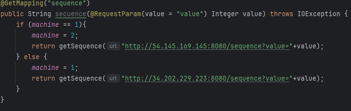
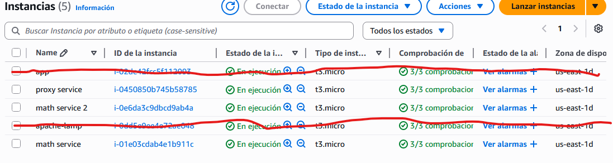
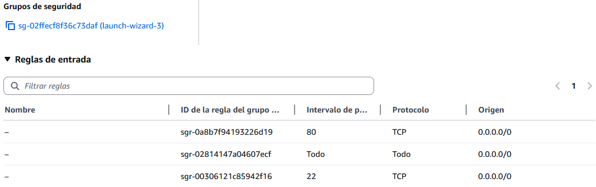
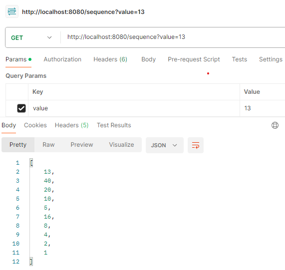

# Parcial 2 - TDSE

## Video de Demostración

EL VIDEO ESTA EN LA RAIZ DEL REPO

[Link al video](video.mp4)

## Descripción

Proyecto de examen que implementa un servicio distribuido para calcular la secuencia de Collatz. La arquitectura consiste en un servicio matemático desplegado en dos instancias separadas y un servicio proxy que distribuye las peticiones entre ambas instancias usando un esquema Round Robin.



## Arquitectura

El proyecto está compuesto por dos servicios Spring Boot:

### Math Service

Servicio REST que calcula la secuencia de Collatz para un número dado.

- Endpoint: `GET /sequence?value={n}`
- Implementa el algoritmo de Collatz: si n es par, n/2; si es impar, 3n+1
- Retorna la secuencia completa hasta llegar a 1


### Proxy Service

Servicio que actúa como balanceador de carga entre dos instancias del Math Service.

- Endpoint: `GET /sequence?value={n}`
- Distribuye peticiones alternando entre dos instancias del Math Service
- Implementa estrategia Round Robin para balanceo de carga
- Incluye interfaz web HTML para realizar consultas



## Despliegue

La arquitectura de despliegue consiste en:

- 2 máquinas con instancias del Math Service (puertos 8080)
- 1 máquina con el Proxy Service que distribuye las peticiones

Cada petición al proxy se redirige alternadamente a una de las dos instancias del servicio matemático.

### Comandos de Instalación

Se instala esto antes que nada


```bash
# Clonar el repositorio
git clone https://github.com/Andr3xDev/TDSE-Parcial.git

# Para Math Service
cd "math service"
./mvnw verify
./mvnw spring-boot:run

# Para Proxy Service
cd proxy
./mvnw verify
./mvnw spring-boot:run
```

### Configuración de Puertos



### Pruebas

Pruebas locales:


Pruebas en producción:


Resultado final:
